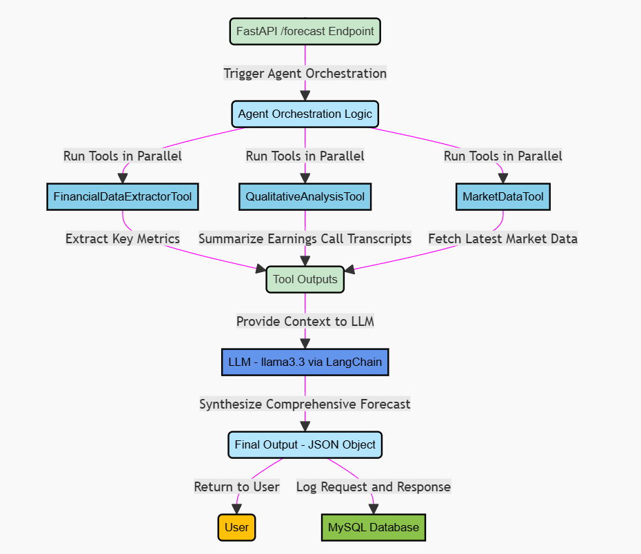
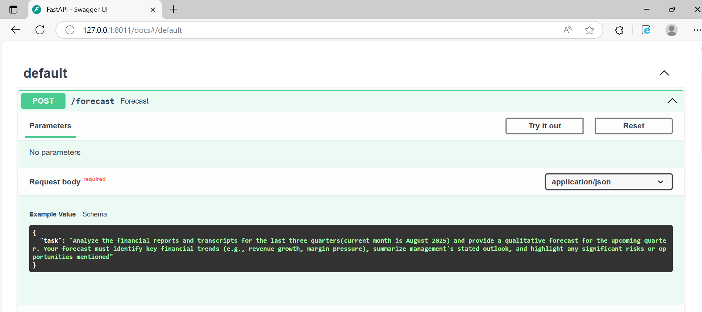
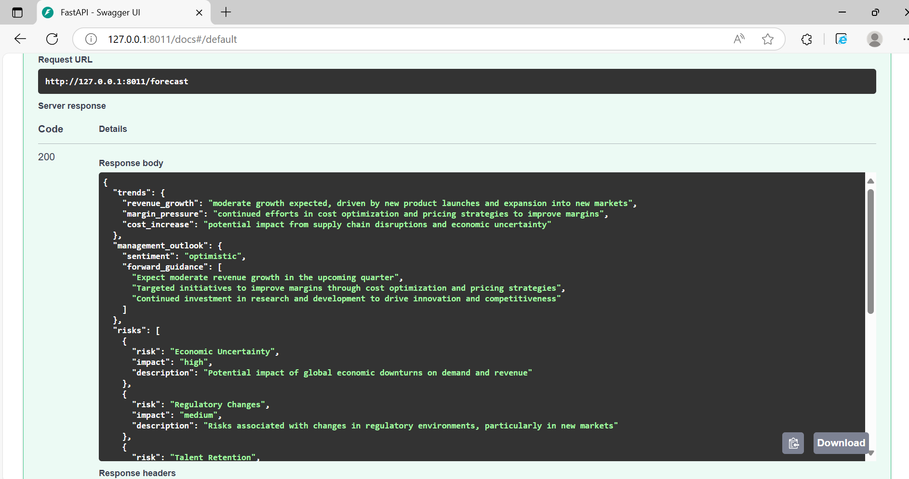
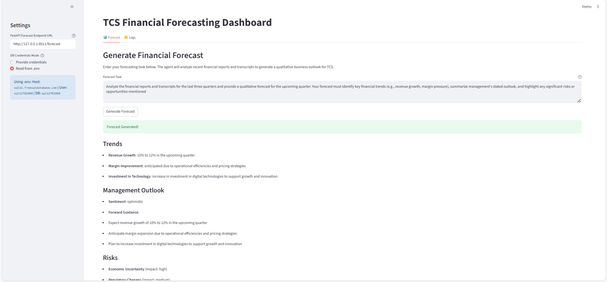
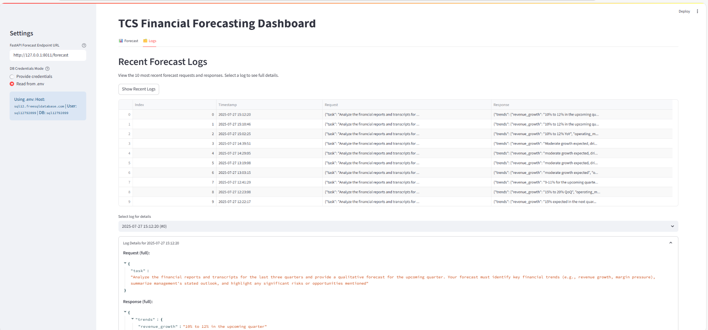

# TCS Financial Forecasting Agent

---

## Application Overview

| Feature                        | Description                                                                 |
|--------------------------------|-----------------------------------------------------------------------------|
| Automated Document Analysis    | Analyzes recent quarterly financial reports and transcripts for TCS                    |
| Modular Tooling                | Specialized tools for financial extraction, qualitative analysis, and current market |
| RAG & LLM Synthesis            | Combines retrieval-augmented generation and LLM for analysis & deep reasoning           |
| Structured JSON Output         | Returns controlled, machine-readable, predictable results                                |
| MySQL Logging                  | Logs all requests and responses for debugging, monitoring and traceability                             |
| Streamlit Dashboard            | User-friendly UI for forecasts and log review                                |

---

## Architectural Approach & Design Choices
- **Modular Tooling:** Each tool (financial extraction, qualitative analysis, market data) is responsible for a distinct part of the analysis pipeline.
- **Retrieval-Augmented Generation (RAG):** Uses a vector store to semantically search and ground the LLM's responses in actual transcript content.
- **LLM Orchestration:** LangChain chains tool outputs and prompts the LLM (Groq's llama-3.3-70b-versatile) with a master prompt for structured, reasoned output.
- **Robust Logging:** All API requests and responses are logged in a MySQL table.
- **Separation of modules:** Tools, agent logic, and API layer are cleanly separated for clarity and testability.
  
---

## How the Forecasting Agent Works (Process Flow)


When you submit a forecasting task (such as eg: "Analyze the last three quarters and provide a qualitative forecast for the upcoming quarter"), your request is received by the FastAPI `/forecast` endpoint. The agent then springs into action, orchestrating three specialized tools in parallel:

- **FinancialDataExtractorTool** dives into the latest quarterly financial reports (from `app/docs/Reports/`) to extract key metrics like revenue, net profit, and margins etc.
- **QualitativeAnalysisTool** semantically searches and analyzes recent earnings call transcripts (from `app/docs/Transcripts/`) to identify recurring themes, management sentiment, and forward-looking statements.
- **MarketDataTool** fetches the latest market data (such as current price and market cap) from a public source (here https://www.screener.in/company/TCS/consolidated/#documents).

- All of these insights are then provided as context to a large language model (LLM) via LangChain, which synthesizes a comprehensive, structured forecast using a master prompt. The result is a clear, machine-readable JSON forecast that highlights trends, management outlook, risks, opportunities, and assumptions. 
- Both your request and the agent's response are logged to a MySQL database for traceability and monitoring. This parallel, modular approach ensures your forecasts are fast, robust, and deeply reasoned.

---

## Agent & Tool Design

### 1. FinancialDataExtractorTool
- This tool extracts key financial metrics (e.g., revenue, net profit, margin, etc.) from the latest quarterly reports.
- **How it works:**
  - Uses the loaded vector store to retrieve the most relevant report sections.
  - Prompts the LLM to extract and structure the required metrics, handling missing data gracefully.
- **Prompt Example:**
  ```
  You are a financial analyst. From the following quarterly financial report context, extract key forecastable business metrics with exact values and periods. If a metric is missing, indicate it as 'N/A'.
  Context:
  {context}
  End goal:
  {task}
  ... [list of metrics] ...
  Ensure all extracted data and commentary are suitable for use in forecasting future quarters.
  ```

### 2. QualitativeAnalysisTool
- This tool performs semantic search and qualitative analysis on 2-3 past earnings call transcripts to identify themes, management sentiment, and forward-looking statements.
- **How it works:**
  - Uses the loaded vector store to retrieve relevant transcript chunks.
  - Prompts the LLM to extract recurring themes, sentiment, forward guidance, risks, and opportunities in structured JSON.
- **Prompt Example:**
  ```
  You are a financial analyst. Do a qualitative analysis of the provided context on latest earnings call transcripts and extract the following:
  1. Recurring Themes
  2. Management Sentiment
  3. Forward-Looking Statements
  4. Risks & Opportunities
  Context:
  {context}
  End goal:
  {task}
  Provide the extracted information in a structured JSON format, including any relevant qualitative metrics or analysis that could inform financial forecasting for future quarters.
  ```

### 3. MarketDataTool
- This tool is fetches live market data (e.g., current price, market cap) from a public source ([Screener.in](https://www.screener.in/company/TCS/consolidated/#documents)).
- **How it works:**
  - Scrapes or queries the latest market data and provides it as context to the LLM for better forecasting upcoming financials.

### 4. Forecast Agent
- This is the master agent that chains together the outputs of all tools and guides the LLM to produce a structured, actionable forecast. The three tools run in parallel for efficient, fast chaining.
- **Prompt Example:**
  ```
  You are a senior financial analyst preparing a forecast for the upcoming quarter.
  Inputs:
  - Financial Metrics (latest quarterly reports):
  {financials}
  - Earnings Call Insights:
  {qualitative}
  - Market Data:
  {market}
  Task:
  {task}
  Using these inputs, create a clear and concise forecast in JSON format with the following sections. You may perform analytical calculations and extrapolations to estimate next quarter’s performance.
  1. trends: Key financial trends like revenue growth, margin changes, cost variations.
  2. management_outlook: Summarize management sentiment and forward guidance.
  3. risks: List main risks, each with a brief description and estimated impact (high/medium/low).
  4. opportunities: List main opportunities, each with a brief description and estimated benefit.
  5. assumptions: Clearly state any assumptions made in your forecast (e.g., market conditions, cost stability, regulatory environment, etc.).
  6. overall_forecast: A summary including any numeric estimates (if possible) and a confidence level ('high', 'medium', or 'low').
  Please format your response as JSON. Avoid extra commentary outside JSON.
  ```
---

## Quickstart!

1. **Clone the Repository**
   ```bash
   git clone https://github.com/moonpiee/TCS-Financial-Forecasting-Agent.git
   cd TCS-Financial-Forecasting-Agent
   ```
2. **Create and Activate a Virtual Environment**
   ```bash
   python -m venv .venv
   # On Unix/macOS:
   source .venv/bin/activate
   # On Windows:
   .venv\Scripts\activate
   ```
3. **Install Dependencies**
   ```bash
   pip install -r requirements.txt
   ```
4. **Configure Environment Variables**
   - Copy `.env.example` to `.env` and fill in your credentials:
     - `GROQ_API_KEY` (for LLM access. Get your GROQ API KEY here: https://console.groq.com/keys)
     - `DB_HOST`, `DB_USER`, `DB_PASSWORD`, `DB_NAME` (for MySQL)
     - `MODEL_NAME` (for analysis and generation)
   - Example `.env`:
     ```
     GROQ_API_KEY=your_groq_api_key
     DB_HOST=localhost
     DB_USER=root
     DB_PASSWORD=yourpassword
     DB_NAME=tcs
     MODEL_NAME=llama-3.3-70b-versatile
     ```
5. **Prepare Data**
   - Place TCS quarterly financial reports in `app/docs/Reports/` and earnings call transcripts in `app/docs/Transcripts/`.
   - The vector store will be built automatically on first run (see `app/tools/vectorstore.py`).
6. **Set Up MySQL Database**
   - Ensure MySQL 8.0+ is running and accessible.
   - Create the database (e.g., `CREATE DATABASE tcs;`).
   - The application will auto-create the `forecast_logs` table if it does not exist.

---

## How to Run

### 1. Start the FastAPI Service
```bash
uvicorn app.main:app --reload
```
- To specify a custom port, use:
```bash
uvicorn app.main:app --reload --port 8011
```
Note: upon the first run, vector store (`app/tools/chroma_db`) and process logs(`logs/app.log`) is created
### 2. Make a Forecast Request (Input is `task: str`)

#### Using Postman or curl:
```bash
curl -X POST "http://localhost:8000/forecast" \
     -H "Content-Type: application/json" \
     -d '{"task": "Analyze the financial reports and transcripts for the last three quarters and provide a qualitative forecast for the upcoming quarter. Your forecast must identify key financial trends (e.g., revenue growth, margin pressure), summarize management's stated outlook, and highlight any significant risks or opportunities mentioned."}'
```
- The response will be a structured JSON object with trends, management outlook, risks, opportunities, assumptions, and an overall forecast.

#### Using Interactive API Docs:
- Open your browser and go to: `http://127.0.0.1:8000/docs` (Note: port may vary according to user)
- Click on the `/forecast` endpoint, then "Try it out", enter your forecasting task, and click "Execute".

---

## Sample Outputs

**API Docs Example:**



**Streamlit Forecast Example:**
- Enter your FastAPI URL and forecasting task, then click "Generate Forecast".


**Streamlit Logs Example:**
- Choose credentials mode, view/download logs, and expand for details.


---

## Streamlit Dashboard (for UI)

1. **Run FastAPI** (as above)
2. **Run Streamlit**
   ```bash
   streamlit run app/streamlit_app.py
   ```
3. **Open the dashboard in your browser** (usually at [http://localhost:8501](http://localhost:8501))
4. **Use the sidebar to set API URL and DB credentials mode**
5. **Use the Forecast and Logs tabs for analysis and log review**

---

## Troubleshooting
- Ensure all environment variables are set and the database is accessible.
- Check logs for errors (FastAPI logs, MySQL logs, process logs in `/logs/app.log`).
- Check if the chromadb vector db is being created on first run in `app/tools/chroma_db/`
- If the vector store is empty, ensure your data files are present and readable.

---
